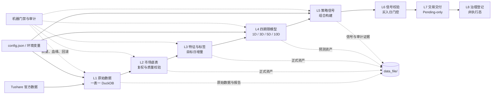

# Quant Vibe 多因子量化项目

Quant Vibe 是面向 A 股的多因子研究与信号生成项目，覆盖原始数据更新、因子加工、模型训练、选股、回测、GM 信号导出和报告生成。

项目默认在本地工作目录运行，路径以仓库根目录为基准，不依赖 GitHub 或其他托管 Git 远端。

## 标准链路默认资产

当前模型侧标准链路使用：

- L1 原始表：`quant/data_file/production_assets/duckdb/l1_raw_tables/[table].duckdb`
- L2 市场底表：`quant/data_file/production_assets/duckdb/l2_stock_daily_data.duckdb::STOCK_DAILY_DATA`
- L3 生产特征：`quant/data_file/production_assets/duckdb/l3_feature_current.duckdb::<active_table>`
- L3 训练标签：`quant/data_file/production_assets/duckdb/l3_label_current.duckdb::<active_table>`
- L4 正式预测资产：`quant/data_file/production_assets/duckdb/l4_*.duckdb`

`quant/data_file/stock_factor_data.parquet`、`quant/data_file/production_factor_parts/`、`quant/data_file/prediction_label_parts/`、`quant/data_file/standard_factor_by_date_parts/`、`quant/data_file/standard_factor_by_date_parts_fast40/` 与 `quant/data_file/odb.db::stock_predict_data_*` 均为历史兼容、回滚或审计资产，不能作为默认训练或预测输入。模型侧如需使用旧链路，必须显式设置 `QUANT_ALLOW_LEGACY_MODEL_ASSET_CHAIN=1`。

## 技术架构



日常流程在本机 Python 与 DuckDB 上运行；Docker 仅是可选的可复现部署方式，并非当前流水线依赖。

## 快速开始

### 1. 打开本地项目

```powershell
cd D:\work\quant\quant_mcp\quant\main
```

在其他本地机器使用时，通过受控本地介质或文件共享复制项目目录后直接打开；标准运行不依赖 GitHub 或其他托管远端。

### 2. 创建本地 Python 环境

```powershell
python -m venv .venv
.\.venv\Scripts\activate
pip install -r requirements.txt
```

Linux/macOS：

```bash
source .venv/bin/activate
```

### 3. 配置 Token

优先使用环境变量，避免把私密 Token 提交到文件：

```powershell
$env:TUSHARE_TOKEN="your_token_here"
```

也可以复制示例配置后编辑：

```powershell
copy config.example.json config.json
```

如需覆盖数据目录：

```powershell
$env:QUANT_DATA_DIR="my_data"
```

## Docker

构建默认镜像：

```bash
docker build -t quant-vibe .
```

使用挂载的本地数据和日志目录运行主流程：

```powershell
docker run --rm `
  -e TUSHARE_TOKEN=your_token_here `
  -v "${PWD}/data_file:/app/data_file" `
  -v "${PWD}/log:/app/log" `
  -v "${PWD}/logs:/app/logs" `
  quant-vibe
```

在同一镜像中运行其他脚本：

```powershell
docker run --rm -e TUSHARE_TOKEN=your_token_here -v "${PWD}/data_file:/app/data_file" quant-vibe python run_production_tasks.py --config config/production_tasks.example.json --dry-run
```

使用 Docker Compose：

```powershell
copy .env.example .env
docker compose up --build
```

可选构建参数：

```bash
# 为 MLP / 深度学习脚本安装 CPU 版 PyTorch
docker build --build-arg INSTALL_TORCH=true -t quant-vibe:torch .

# 环境能访问 GM SDK 时安装该依赖
docker build --build-arg INSTALL_GM=true -t quant-vibe:gm .

# 使用自定义 PyPI 镜像
docker build --build-arg PIP_INDEX_URL=https://pypi.tuna.tsinghua.edu.cn/simple -t quant-vibe .
```

镜像将运行数据写入 `/app/data_file`，日志写入 `/app/log` 和 `/app/logs`，本地 GM 策略目录为 `/app/juejin_strategies`。这些目录均作为 volume 声明，且不纳入 Git。

## 当前工作流

标准分层工作流见：

- `WORKFLOW.md`
- `quant/main/AGENTS.md`

当前默认资产：

- L1 原始 DuckDB 表：`quant/data_file/production_assets/duckdb/l1_raw_tables/[table].duckdb`
- 历史 DuckDB bundle：`quant/data_file/production_assets/duckdb/quant_production.duckdb`，不是当前 active 路由
- L2 市场底表：`quant/data_file/production_assets/duckdb/l2_stock_daily_data.duckdb::STOCK_DAILY_DATA`
- L3 生产特征：`quant/data_file/production_assets/duckdb/l3_feature_current.duckdb::<active_table>`
- L3 训练标签：`quant/data_file/production_assets/duckdb/l3_label_current.duckdb::<active_table>`
- L4 预测资产：独立预测资产方案；`odb.db.stock_predict_data_*` 不是新链路默认入口
- L5 标准自动化入口：`quant/main/run_production_tasks.py`

强制治理规则：

- 前复权价格与由前复权价格生成的技术字段/因子，必须在字段名、schema 或 contract 中明确标记 `qfq`。
- 实际值为前复权但继续使用裸 `open/high/low/close/pre_close` 表达主线语义时，属于治理缺陷，不能继续扩散到模型、策略或交易环节。

L5 读取正式 manifest 时必须满足：

- `approval_status=approved_for_l5`。
- 明确给出非 legacy L4 预测资产的 `db_path` 和 `table`。
- 指向 `odb.db` 或历史预测表的 manifest 只能用于历史复现，不能作为默认生产信号入口。

L1 原始数据消费者契约：

- `quant/main/l1_raw_data_route.py` 是正式 L1 读取入口。
- 当前 active L1 后端为 `quant/data_file/production_assets/duckdb/l1_raw_tables/[table].duckdb` 下的一表一 DuckDB。
- 历史 SQLite L1 不属于默认链路，仅在历史回滚时通过显式 opt-in 使用。
- `quant/main/raw_table_db_module.py` 默认写 DuckDB；除非为历史回滚显式设置 `QUANT_ALLOW_LEGACY_RAW_SQLITE=1`，否则拒绝旧 SQLite 写模式。

## 常用命令

```powershell
# 仅用于历史 mixed-db 链路；需要显式设置：
# QUANT_ALLOW_LEGACY_MAIN=1
python main.py

# 仅用于历史宽表因子重建
python run_cdb_update.py

# 仅用于历史宽表因子增量维护
python run_incremental_cdb_update.py

# 新链路生产因子分片的目标日增量更新
python incremental_factor_update_target_date.py --target-date YYYYMMDD

# 目标日按 part 分段补跑，并分别落盘 chunk 报告
python run_incremental_factor_update_chunked.py --target-date YYYYMMDD

# 训练模型并写入预测
python run_pdb_update.py

# 仅用于历史 mixed-asset 日常编排；需要显式 opt-in：
# QUANT_ALLOW_LEGACY_DAILY_STRATEGY=1
.\run_daily_strategy.ps1 -AllowLegacyAssetChain

# 推荐的 L5 自动化入口
python run_production_tasks.py --config config/production_tasks.example.json --dry-run

# 安装 Windows 每日 24:00 的生产策略自动化任务
.\install_production_scheduled_task.ps1

# 导出股票池
python export_stock_pool.py

# 生成 GM 策略报告
python generate_juejin_strategy_reports.py
```

`python main.py` 是为回滚和复现保留的历史 mixed-db 入口，不是当前分层工作流推荐入口。

`daily_strategy.py` 与 `run_daily_strategy.ps1` 同样是历史 mixed-asset 编排入口，仍依赖 `stock_factor_data.parquet` 与 `odb.db.stock_predict_data_*`，必须显式 opt-in，不能作为标准 L5 信号路径。

`run_cdb_update.py` 与 `run_incremental_cdb_update.py` 维护历史兼容宽因子 parquet。当前默认 L3 特征资产是 active DuckDB L3 特征文件；`production_factor_parts/` 仅保留为历史回滚证据。

`config/production_tasks.example.json` 默认禁用，只有模型智能体提供带明确 `db_path` 和 `table` 的 `approved_for_l5` manifest 后才可以启用。

同理，`config/prediction_manifests/prod_liq_prime_one_v20260612_l4_formal.json` 只是占位文件，更新为真实已批准 L4 asset manifest 前，L5 自动化必须保持禁用。

GM 相关脚本默认读取 `juejin_strategies/` 下的相对路径。请将自有 GM 策略 `main.py` 放入该目录，或在支持时通过命令行参数指定策略目录。

## 项目结构

| 路径 | 用途 |
| --- | --- |
| `README.md` | 项目说明、技术架构和本地运行入口 |
| `AGENTS.md` | 多智能体职责、模型路由和治理约束 |
| `WORKFLOW.md` | L1 到 L8 的标准工作流 |
| `project_paths.py` | 集中的路径与配置解析器 |
| `config.json` | 本地默认配置，可通过环境变量提供 Token |
| `config.example.json` | 可共享配置模板 |
| `config/` | 生产任务、模型与运行策略配置 |
| `Dockerfile` | 可复现运行镜像 |
| `docker-compose.yml` | 挂载数据/日志目录的本地容器入口 |
| `.dockerignore` | 排除 Docker 构建上下文中的数据、缓存和 Git 文件 |
| `deploy/` | 可选的云中心和 MCP 容器部署方案 |
| `config/production_tasks.example.json` | 已登记生产策略的自动化配置示例 |
| `run_production_tasks.py` | 运行已登记生产策略的自动化任务 |
| `install_production_scheduled_task.ps1` | 安装 Windows 每日 24:00 生产自动化任务 |
| `data_file/` | 本地 DuckDB 数据、信号、报告和运行证据，不提交 |
| `log/`、`logs/` | 运行日志，不提交 |
| `juejin_strategies/` | 本地 GM 策略，不提交 |
| `docs/` | 架构、治理与部署文档 |
| `tools/` | 校验、切换、审计和运维脚本 |
| `tests/` | 单元测试 |

## 说明

- 项目不依赖固定的本机绝对路径。
- 默认输出位于 `data_file/`。
- `config.json` 中的 `datasource.tushare_token` 可以为空；运行时 `TUSHARE_TOKEN` 优先。
- `config.json` 仅限本地使用并被 Git 忽略，请从 `config.example.json` 创建。
- 大型数据、日志、缓存与本地 GM 策略均排除在 Git 和 Docker 构建上下文外。

本项目仅用于量化研究和策略验证，不构成投资建议。真实交易前应核验数据质量、复现回测、评估成本、配置风控，并以小资金充分测试。
