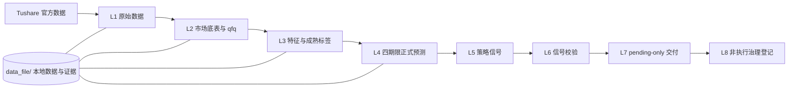

# Quant Vibe 多因子量化项目

Quant Vibe 是面向 A 股的本地量化研究与信号生成项目，覆盖官方数据接入、特征加工、模型预测、组合信号和非执行态交易交付。

项目运行在本机 Python 与 DuckDB 环境中，不使用 Docker、云中心或云服务器。

## 技术链路



## 本地初始化

### 1. 进入项目目录

```powershell
cd D:\work\quant\quant_mcp\quant\main
```

### 2. 创建 Python 环境

```powershell
python -m venv .venv
.\.venv\Scripts\activate
pip install -r requirements.txt
```

项目自动化默认使用统一解释器：`D:\work\quant\quant_mcp\.venv\Scripts\python.exe`。

### 3. 配置 Tushare Token

```powershell
$env:TUSHARE_TOKEN="your_token_here"
copy config.example.json config.json
```

真实 Token、`config.json`、`data_file/` 和本地日志不提交到 Git。

### 4. 运行本地自检

```powershell
D:\work\quant\quant_mcp\.venv\Scripts\python.exe tools\check_source_layout.py
D:\work\quant\quant_mcp\.venv\Scripts\python.exe tools\agent_governance_check.py
D:\work\quant\quant_mcp\.venv\Scripts\python.exe tools\standard_agent_architecture_check.py
D:\work\quant\quant_mcp\.venv\Scripts\python.exe tools\check_workflow_asset_alignment.py
```

### 5. 首次全量数据初始化

新机器首次建库不能直接运行日常增量链路。必须先取得明确授权，并按 [全量数据初始化工作流](docs/governance/full-history-initialization-workflow.md) 执行 F0-F4：全量 L1、L2、L3，必要时重放不变正式模型的 L4 预测。

全量初始化默认不生成策略信号、不创建交易交付、不进入 L5-L8。完成后，日常任务才从最新交易日按 L1-L8 增量运行。

## 日常 L1-L8 增量工作流

| 层级 | 负责角色 | 工作内容 |
| --- | --- | --- |
| L1 | 数据接入智能体 | 官方源检查、原始表与 L1 DuckDB |
| L2 | 数据整合智能体 | 目标日底表和 qfq 整合 |
| L3 | 因子智能体 | 目标日特征与独立成熟标签 |
| L4 | 模型智能体 | 1D/3D/5D/10D 正式预测刷新 |
| L5/L6 | 策略智能体 | 信号生成与校验 |
| L7 | 交易智能体 | pending-only 交付与买入日硬门 |
| L8 | MCP / 指挥官 | 非执行治理登记与状态监控 |

主链必须满足：`no-BJ`、`DuckDB-only`、一表一文件、显式 qfq、原子回滚。真实交易不由该链路自动触发。

## Codex 多智能体配置

在 Codex 桌面端打开工作区 `D:\work\quant\quant_mcp`，为指挥官、审计、架构、数据接入、数据整合、因子、模型、策略、交易、MCP 和投研角色分别建立独立任务。

所有跨角色工作必须由指挥官在可见任务中显式分派；专业角色只在自己的任务中执行和回报。默认模型为 **TERRA**，`thinking=medium`；仅当前端明确指定时才覆盖。

## 项目结构

| 路径 | 用途 |
| --- | --- |
| `config/` | 可版本化配置与工作流合同 |
| `docs/governance/` | 工作流、数据合同和治理说明 |
| `tools/` | 校验、治理与运维工具 |
| `research/` | 活跃研究与归档研究 |
| `legacy/` | 历史复现和兼容脚本 |
| `strategy_library/` | 策略定义、归档和候选记录 |
| `tests/` | 自动化测试 |
| `data_file/` | 本地 DuckDB、报告、信号和运行证据，不提交 |

## 文档导航

- [日常 L1-L8 增量工作流](docs/governance/latest-incremental-workflow-l1-l8.md)
- [全量数据初始化工作流](docs/governance/full-history-initialization-workflow.md)
- [增量路由合同](docs/governance/incremental-route-contract.md)
- [线程制智能体管理](docs/governance/thread-based-agent-management.md)
- [源码布局规则](docs/governance/source-layout-policy.md)

## 使用边界

本项目用于研究与策略验证，不构成投资建议。真实交易前必须独立核验数据、成本、风险控制和执行条件。
