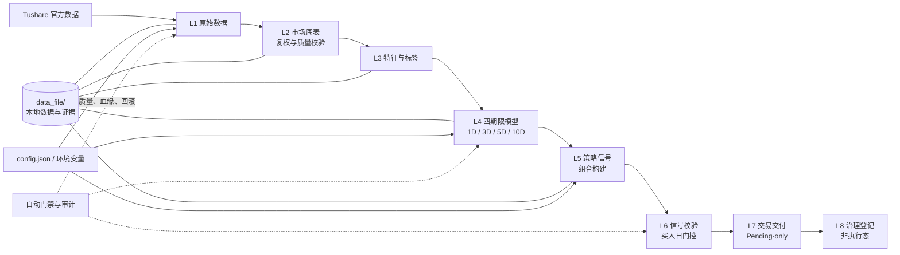

# Quant Vibe 多因子量化项目

Quant Vibe 是一个面向 A 股的本地量化研究与信号生成项目，覆盖数据接入、特征加工、模型预测、组合信号和非执行态交易交付。

项目仅在本机 Python 与 DuckDB 环境中运行，不提供云中心或云服务器部署方案。

## 技术架构



## 快速开始

### 1. 打开项目

```powershell
cd D:\work\quant\quant_mcp\quant\main
```

### 2. 创建 Python 环境

```powershell
python -m venv .venv
.\.venv\Scripts\activate
pip install -r requirements.txt
```

### 3. 配置数据令牌

推荐通过环境变量提供 Tushare Token：

```powershell
$env:TUSHARE_TOKEN="your_token_here"
```

也可从模板创建本地配置：

```powershell
copy config.example.json config.json
```

## 项目结构

| 路径 | 用途 |
| --- | --- |
| `README.md` | 项目首页与快速开始 |
| `AGENTS.md` | 多智能体职责、模型路由与协作规则 |
| `docs/governance/` | 工作流、数据契约、治理和部署说明 |
| `config/` | 运行与自动化配置模板 |
| `data_file/` | 本地 DuckDB 数据、报告、信号和运行证据，不提交 |
| `log/`、`logs/` | 本地运行日志，不提交 |
| `juejin_strategies/` | 本地 GM 策略文件，不提交 |
| `tools/` | 校验、审计、切换和运维脚本 |
| `tests/` | 自动化测试 |
| `Dockerfile`、`docker-compose.yml` | 可选的本地容器运行入口 |

## 文档导航

| 主题 | 文档 |
| --- | --- |
| L1-L8 增量工作流 | [latest-incremental-workflow-l1-l8.md](docs/governance/latest-incremental-workflow-l1-l8.md) |
| 数据与路由契约 | [incremental-route-contract.md](docs/governance/incremental-route-contract.md) |
| 多智能体与线程协作 | [thread-based-agent-management.md](docs/governance/thread-based-agent-management.md) |
| 运行与模型治理 | [runtime-governance.md](docs/governance/runtime-governance.md) |
| 项目文档索引 | [project-doc-map.md](docs/governance/project-doc-map.md) |

## 使用边界

- `config.json`、`data_file/`、日志和本地 GM 策略均不提交到 Git。
- 标准生产链路使用受控的 L1-L8 分层资产；历史兼容资产仅可在明确授权下使用。
- 本项目用于研究和策略验证，不构成投资建议。真实交易前必须独立核验数据、成本、风控与执行条件。
