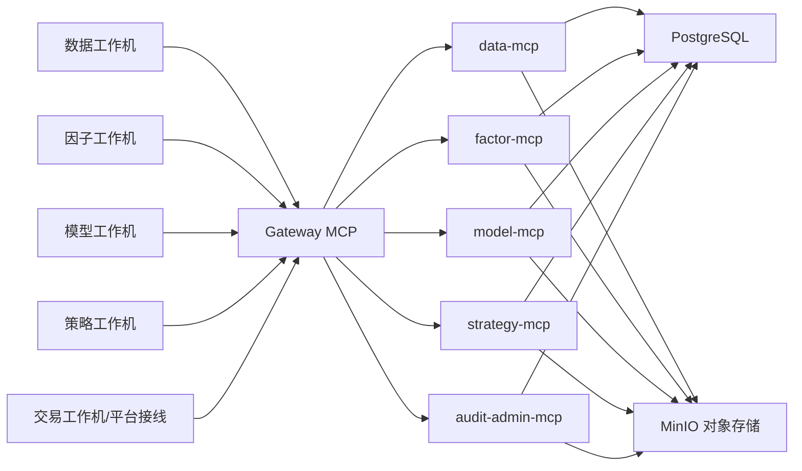

# 2026-06-20 量化中台云数据库与 MCP 分离部署设计

## 1. 背景

当前项目已经形成较清晰的分层资产口径：

- L1 原始数据：`quant/data_file/raw_table_dbs/[table].DB`
- L2 综合底表：`quant/data_file/STOCK_DAILY_DATA.db::STOCK_DAILY_DATA`
- L3 投产特征：`quant/data_file/production_factor_parts/`
- L3 训练标签：`quant/data_file/prediction_label_parts/`
- L4 正式预测资产：通过 formal manifest 管理
- L5 策略、信号、发布与归档：位于 `strategy_library/`、`published_strategies/` 及相关目录

当前主要问题不是“缺少分层”，而是“正式共享资产仍主要落在本地文件系统”：

1. 多台工作机或多智能体协作时，正式资产共享依赖本地路径，不利于远程协同。
2. SQLite、Parquet、CSV、报告和归档分散在项目目录中，统一权限、审计、访问控制较弱。
3. 部分资产适合数据库管理，部分资产适合文件对象存储，当前缺少正式中台承接。
4. MCP 服务已具备雏形，但当前更偏策略共享和发布，不是完整的数据、因子、模型、策略统一服务层。

用户目标是：将数据、因子、模型结果、策略资产做分离部署，使用一台专用机器承载云数据库与对象存储，并通过 MCP 统一对外提供服务。

## 2. 设计目标

本方案目标如下：

1. 建立一台专用“量化资产中台机”，作为正式共享资产中心。
2. 使用 PostgreSQL 承载正式结构化资产、元数据、审计和注册表。
3. 使用对象存储承载大文件、分片、报告、快照、导出件和归档。
4. 使用多 MCP 子服务按域对外暴露统一接口，禁止客户端直接依赖底层路径。
5. 保留当前本地工作机的计算职责：数据接入、因子计算、模型训练、预测、策略研究继续在本地执行，计算结果再发布到云端。
6. 让正式资产的“发布、审批、查询、回滚、审计”在云端集中治理。

本方案不以“把所有计算都搬到云端”为目标。云端机器在一期主要承担正式资产中心，而不是统一算力中心。

## 3. 非目标

本方案明确不做以下事情：

1. 不在一期把所有研究中间产物都迁移到云端。
2. 不要求把所有因子、模型、策略脚本改造成远程执行。
3. 不要求把交易执行、QMT、掘金实盘全部集中到云机器。
4. 不在一期把所有旧 SQLite、Parquet、CSV 路由立刻废弃；它们先降级为缓存、回滚或 legacy 资产。
5. 不把 PostgreSQL 直接暴露为公网通用数据库入口。

## 4. 推荐总体架构

推荐方案：`PostgreSQL + MinIO 对象存储 + 多 MCP 子服务 + 统一 Gateway`



### 4.1 角色定位

云中台机负责：

- 正式资产存储
- MCP 服务
- 统一鉴权
- 审计日志
- 资产注册和版本治理
- 定时备份
- 正式导出件归档

本地工作机负责：

- 原始数据接入
- 因子计算
- 模型训练与预测
- 策略研究与回测
- 信号生成
- 向云端发布正式资产

### 4.2 设计原则

1. 对外访问统一走 MCP，不直接暴露 PostgreSQL 业务表。
2. PostgreSQL 管“事实表、元数据、权限、版本、审批、审计”。
3. 对象存储管“大文件、分片、快照、报告、导出件、归档件”。
4. 工作机之间不共享本地正式资产，只共享“云端已发布正式资产”。
5. 正式资产必须具备 `asset_id + version + lineage + audit`。

## 5. 资产分层与存储映射

### 5.1 L1 原始数据层

当前资产：

- 原始 parquet
- `raw_table_dbs/[table].DB`
- `odb.db` 中遗留 raw tables

云端建议：

- PostgreSQL：保存正式 L1 原始表
- 对象存储：保存原始 parquet 快照和按批次导入包

PostgreSQL 中建议 schema：`l1_raw`

表示例：

- `l1_raw.daily_data`
- `l1_raw.daily_basic`
- `l1_raw.stk_factor`
- `l1_raw.moneyflow`
- `l1_raw.adj_factor`
- `l1_raw.limit_list_data`
- `l1_raw.stock_st`
- `l1_raw.index_daily`
- `l1_raw.daily_index_data`
- `l1_raw.finan_data_season`
- `l1_raw.finan_data_year`

说明：

- 本地 `raw_table_dbs/[table].DB` 不再作为正式共享资产中心，而是工作机缓存与回滚资产。
- 云端 `l1_raw.*` 才是正式共享原始数据事实源。

### 5.2 L2 综合底表层

当前资产：

- `STOCK_DAILY_DATA.db::STOCK_DAILY_DATA`

云端建议：

- PostgreSQL：`l2_market.stock_daily_data`

说明：

- 这是最适合数据库化管理的一层。
- 该层行级结构稳定、查询频繁、策略和因子都会引用，适合作为标准共享底表。
- 必须保留当前“前复权口径”治理约束。

### 5.3 L3 因子与标签层

当前资产：

- `production_factor_parts/`
- `prediction_label_parts/`

云端建议：

- 对象存储：正式因子与标签分片
- PostgreSQL：仅保存其元数据、版本、分区清单、schema 版本和审计结果

原因：

1. 因子和标签通常体量大、列多、按日或按分片组织，适合对象存储而非硬塞 PostgreSQL。
2. 访问模式多为“按版本、按交易日、按 part 批量读取”，更适合 Parquet + 对象存储。

建议：

- MinIO bucket：`quant-l3-factors`
- MinIO bucket：`quant-l3-labels`
- PostgreSQL schema：`l3_feature_meta`

表示例：

- `l3_feature_meta.factor_asset_versions`
- `l3_feature_meta.factor_part_inventory`
- `l3_feature_meta.label_asset_versions`
- `l3_feature_meta.label_part_inventory`
- `l3_feature_meta.factor_schema_registry`

### 5.4 L4 模型与预测层

当前资产：

- formal manifest
- 预测结果表
- 模型训练与评估结果

云端建议：

- PostgreSQL：保存正式预测资产注册表、manifest、指标摘要、小到中型预测结果
- 对象存储：保存大批量预测明细分片、模型包、评估附件、报告

PostgreSQL schema：`l4_model`

表示例：

- `l4_model.model_registry`
- `l4_model.prediction_asset_registry`
- `l4_model.prediction_results`
- `l4_model.evaluation_metrics`
- `l4_model.formal_manifest_registry`

对象存储建议 bucket：

- `quant-l4-predictions`
- `quant-reports`

### 5.5 L5 策略与信号层

当前资产：

- `strategy_library/`
- `published_strategies/`
- `gm_signals*.csv`
- daily summary / signal summary

云端建议：

- PostgreSQL：保存策略注册表、策略版本、信号注册、信号明细、导出记录
- 对象存储：保存信号 CSV、报告、快照、平台导出包

PostgreSQL schema：`l5_strategy`

表示例：

- `l5_strategy.strategy_registry`
- `l5_strategy.strategy_versions`
- `l5_strategy.signal_registry`
- `l5_strategy.signal_rows`
- `l5_strategy.delivery_exports`

对象存储 bucket：

- `quant-signals`
- `quant-reports`

## 6. PostgreSQL 逻辑库设计

建议数据库名：`quant_center`

建议 schema：

### 6.1 `meta`

存放全局元数据和资产血缘：

- `asset_registry`
- `schema_registry`
- `manifest_registry`
- `job_runs`
- `lineage_edges`
- `approval_registry`

### 6.2 `l1_raw`

存放正式 L1 原始表。

### 6.3 `l2_market`

存放正式底表：

- `stock_daily_data`

### 6.4 `l3_feature_meta`

存放因子和标签的版本、schema、分片清单、分区摘要。

### 6.5 `l4_model`

存放模型、预测资产、formal manifest、预测摘要和指标。

### 6.6 `l5_strategy`

存放策略注册、策略版本、信号发布、平台导出状态。

### 6.7 `audit`

存放读写审计、权限日志、审批操作、回收站日志。

## 7. 对象存储设计

建议使用 MinIO，自建对象存储，不在一期依赖公有云 OSS/S3。

### 7.1 建议 buckets

- `quant-l3-factors`
- `quant-l3-labels`
- `quant-l4-predictions`
- `quant-signals`
- `quant-reports`
- `quant-snapshots`
- `quant-recycle-bin`

### 7.2 对象路径规范

示例：

```text
quant-l3-factors/
  production_factor_parts/
    version=20260620/
      trade_date=20260618/
        part-0001.parquet

quant-l3-labels/
  prediction_label_parts/
    label=5d_open_return/
      version=20260620/
        trade_date=20260618/
          part-0001.parquet

quant-l4-predictions/
  asset_id=prod_liq_prime_one_v20260612/
    version=20260620/
      prediction_date=20260618/
        predictions.parquet

quant-reports/
  factor/
  model/
  strategy/
  audit/
```

### 7.3 为什么使用对象存储

1. 适合大文件和分片。
2. 适合保存历史版本和快照。
3. 适合和 PostgreSQL 元数据做分工。
4. 后续若要扩展到多机计算或异地备份更方便。

## 8. MCP 服务拆分

建议把现有 `mcp_server/` 演进为“统一网关 + 多域服务”结构。

### 8.1 Gateway MCP

职责：

- 统一鉴权
- 工具发现
- 请求路由
- 速率限制
- 统一错误格式
- 统一审计入口

### 8.2 Data MCP

职责：

- L1/L2 查询
- L1/L2 发布登记
- 数据日期覆盖查询
- 原始表审计摘要查询

建议工具：

- `data.list_trade_dates`
- `data.get_raw_table_snapshot`
- `data.get_stock_daily`
- `data.publish_l1_asset`
- `data.publish_l2_asset`

### 8.3 Factor MCP

职责：

- 因子和标签版本查询
- 因子 schema 查询
- 分片位置解析
- 正式因子/标签资产发布

建议工具：

- `factor.list_factor_assets`
- `factor.get_factor_part`
- `factor.get_label_part`
- `factor.get_factor_schema`
- `factor.publish_factor_asset`
- `factor.publish_label_asset`

### 8.4 Model MCP

职责：

- 模型注册
- 预测资产发布
- formal manifest 查询与审批状态管理
- 指标和评估摘要查询

建议工具：

- `model.list_prediction_assets`
- `model.get_predictions`
- `model.get_manifest`
- `model.publish_prediction_asset`
- `model.get_model_metrics`
- `model.approve_for_l5`

### 8.5 Strategy MCP

职责：

- 策略注册
- 信号查询
- 导出状态查询
- 策略档案读取

建议工具：

- `strategy.list_strategies`
- `strategy.get_strategy_profile`
- `strategy.get_today_signals`
- `strategy.get_signal_history`
- `strategy.publish_signal_asset`

### 8.6 Audit / Admin MCP

职责：

- 用户与 API key 管理
- 审批与审计查询
- 资产血缘与回收站记录查询

建议工具：

- `admin.create_api_key`
- `admin.disable_api_key`
- `admin.register_asset`
- `audit.get_access_logs`
- `audit.get_write_logs`
- `audit.get_asset_lineage`

## 9. 写入模式设计

### 9.1 小型结构化写入

适用对象：

- manifest
- 审批状态
- 策略注册
- 模型注册
- 导出状态
- 指标摘要

方式：

- 直接调用 MCP 写接口
- 直接写 PostgreSQL

### 9.2 大型资产写入

适用对象：

- 因子分片
- 标签分片
- 大批量预测结果
- 审计报告包
- 回测日志
- 信号导出件

方式：

1. 本地先生成标准文件
2. 上传对象存储临时区
3. 调用 MCP 发布接口
4. MCP 校验元数据、写 PostgreSQL 注册表
5. 资产标记为正式版本

该模式优于“直接把大文件塞进 JSON 请求体”。

## 10. 权限与安全设计

### 10.1 网络边界

1. PostgreSQL 不直接暴露公网。
2. MinIO 不裸露公网控制台。
3. 外部只通过 HTTPS 访问 Gateway MCP。
4. 内部建议通过 VPN、内网或 Zero Trust 控制访问。

### 10.2 角色建议

- `admin`
- `audit_reader`
- `reader`
- `writer_l1_l2`
- `writer_l3`
- `writer_l4`
- `writer_l5`
- `strategy_consumer`

### 10.3 智能体映射建议

- 数据接入智能体：`writer_l1_l2`
- 数据整合智能体：`writer_l2`
- 因子智能体：`writer_l3`
- 模型智能体：`writer_l4`
- 策略智能体：`writer_l5`
- 交易智能体：`strategy_consumer`
- 审计智能体：`audit_reader`
- 指挥官/管理员：`admin`

### 10.4 审计要求

所有写操作至少记录：

- actor
- role
- source_host
- tool_name
- target_asset
- target_version
- published_at
- previous_version
- result

## 11. 部署建议

### 11.1 操作系统

建议专用云中台机使用 Linux，而不是 Windows。

理由：

1. PostgreSQL 与 MinIO 长期运行更稳定。
2. Docker、备份、监控、反向代理配置更成熟。
3. 路径和权限模型更清晰。

### 11.2 最低推荐规格

- CPU：8 核
- 内存：32GB
- 系统盘：200GB
- 数据盘：2TB 起

若后续 L3/L4 版本积累快，建议直接 4TB 起步。

### 11.3 容器组件

- `postgres`
- `minio`
- `gateway-mcp`
- `data-mcp`
- `factor-mcp`
- `model-mcp`
- `strategy-mcp`
- `audit-admin-mcp`
- `nginx` 或 `caddy`
- `backup-runner`

### 11.4 目录结构建议

```text
/opt/quant-center/
  compose/
  env/
  mcp/
  scripts/

/data/quant-center/
  postgres/
  minio/
  backups/
  imports/
  exports/
  logs/
```

## 12. 与当前项目的映射关系

### 当前项目资产 -> 云端正式资产

- `quant/data_file/raw_table_dbs/[table].DB`
  -> `l1_raw.*`

- `quant/data_file/STOCK_DAILY_DATA.db::STOCK_DAILY_DATA`
  -> `l2_market.stock_daily_data`

- `quant/data_file/production_factor_parts/`
  -> MinIO `quant-l3-factors` + PostgreSQL `l3_feature_meta.*`

- `quant/data_file/prediction_label_parts/`
  -> MinIO `quant-l3-labels` + PostgreSQL `l3_feature_meta.*`

- formal prediction manifest
  -> PostgreSQL `meta.manifest_registry` / `l4_model.formal_manifest_registry`

- `strategy_library/production/*`
  -> PostgreSQL `l5_strategy.*` + MinIO 报告和归档副本

## 13. 分阶段迁移方案

### 阶段 1：中台底座

目标：

- 部署 PostgreSQL
- 部署 MinIO
- 部署 Gateway MCP
- 打通鉴权、审计、基础健康检查

产物：

- 可访问的 MCP 网关
- 最基础的 `meta`、`audit` schema
- API key 和角色体系

### 阶段 2：迁移 L1/L2

目标：

- 把当前正式 L1 表导入 `l1_raw`
- 把 `STOCK_DAILY_DATA` 导入 `l2_market.stock_daily_data`

要求：

- 先只做“读云端”
- 本地旧资产保留作为回滚与对照

### 阶段 3：迁移正式 L3

目标：

- 正式 `production_factor_parts` 和 `prediction_label_parts` 发布到对象存储
- PostgreSQL 建立版本和分片清单

要求：

- 只迁正式资产
- 不迁历史研究垃圾和临时 smoke 产物

### 阶段 4：迁移正式 L4

目标：

- formal manifest 注册入库
- 正式预测资产发布上云
- L5 只读 formal 资产

### 阶段 5：迁移正式 L5

目标：

- 策略注册、信号发布、平台导出记录入云
- 交易与外部服务改为读取云端正式信号

### 阶段 6：收口旧默认路由

目标：

- 旧 SQLite、本地共享路径降级为缓存、legacy、回滚资产
- 不再作为默认共享正式资产口径

## 14. 风险与约束

### 14.1 主要风险

1. 一次性全量切换风险高，必须按阶段迁移。
2. L3 因子 schema 如果未冻结，会导致云端版本治理困难。
3. 若允许客户端直接连 PostgreSQL，会绕过 MCP 审计和边界控制。
4. 若把研究中间产物也上云，会快速污染正式资产中心。
5. 若 MinIO 与 PostgreSQL 之间没有统一 `asset_id/version`，会产生“文件在、元数据丢”或“元数据在、文件丢”的问题。

### 14.2 应对策略

1. 分阶段迁移，先读后写。
2. 正式资产强制版本化。
3. Gateway 作为唯一正式入口。
4. 研究资产与正式资产分离。
5. 发布必须写入 PostgreSQL 注册表。

## 15. 验收标准

满足以下条件，可视为一期成功：

1. 一台专用云中台机稳定运行 PostgreSQL、MinIO、Gateway MCP。
2. L1/L2 正式资产可通过 MCP 查询，不再依赖本地共享路径。
3. L3 正式因子与标签可通过对象存储 + 元数据注册方式访问。
4. L4 formal prediction asset 可通过 manifest 和 MCP 查询。
5. L5 正式信号可以通过云端注册表和导出记录管理。
6. 所有正式写入具备审计留痕。
7. 旧本地资产已降级为缓存、回滚或 legacy，而不是默认共享资产。

## 16. 推荐实施顺序

推荐实施顺序如下：

1. 先建云中台底座。
2. 先迁 L1/L2。
3. 再迁正式 L3。
4. 再迁 formal L4。
5. 最后迁 L5 和交易读路由。

原因：

- L1/L2 最基础，且最适合数据库化。
- L3 体量大，需先有对象存储与版本元数据。
- L4/L5 依赖前面层的正式资产口径。
- 交易接线应当最后切换，避免过早影响实盘/模拟盘出口。

## 17. 当前建议

当前建议按以下策略推进：

1. 本方案作为正式架构设计稿。
2. 下一步单独产出：
   - 云中台库表设计草案
   - 分阶段迁移实施清单
3. 在业务脚本改造前，先冻结“正式资产发布口径”和“asset_id/version 规则”。
4. 在策略与交易链路切换前，先让审计智能体复核新旧路由的一致性。

本方案定位为“正式资产中心设计”，不是“云端统一算力平台设计”。
